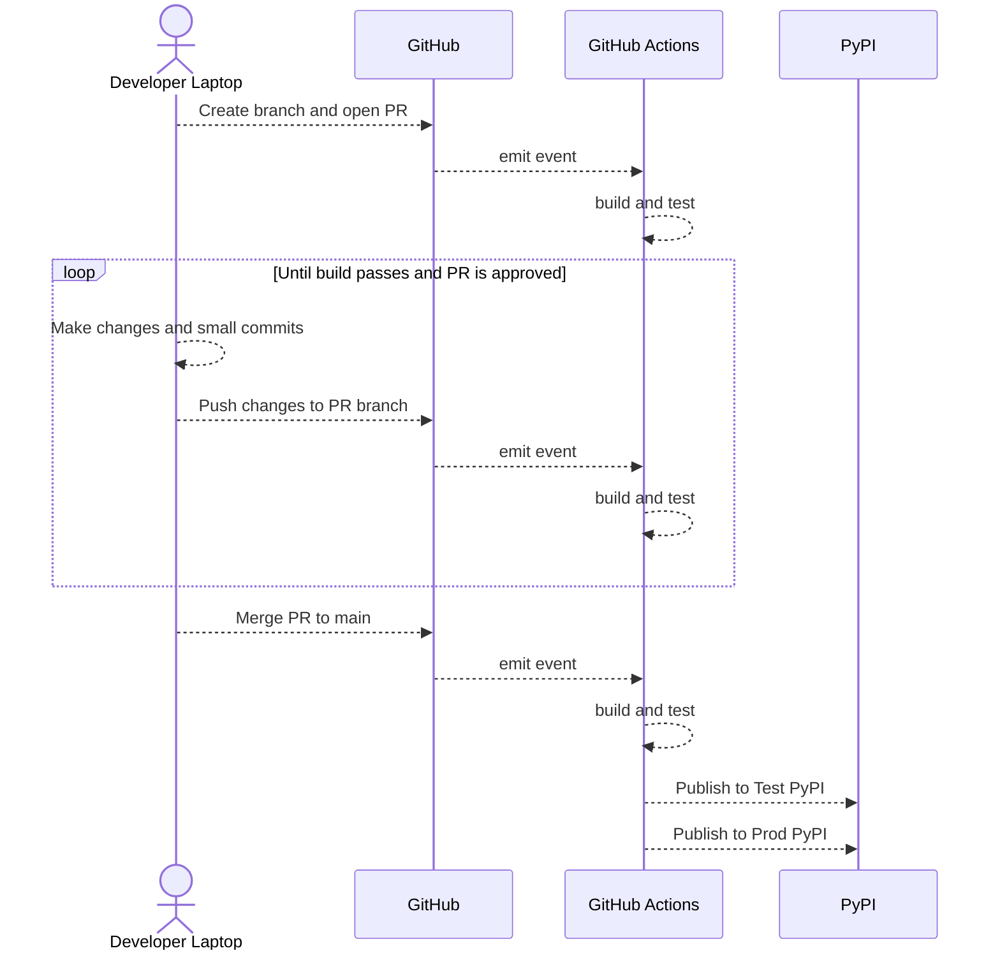
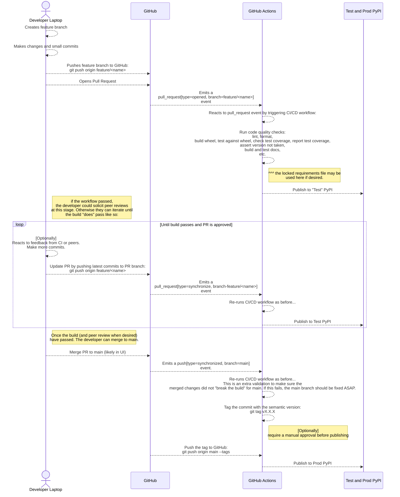

## High-level CI/CD Workflow for Python packages

```mermaid
sequenceDiagram
    actor Developer Laptop
    participant GitHub
    participant GitHub Actions
    participant PyPI

    Developer Laptop-->>GitHub: Create branch and open PR
    GitHub-->>GitHub Actions: emit event
    GitHub Actions-->>GitHub Actions: build and test

    loop Until build passes and PR is approved
        Developer Laptop-->>Developer Laptop: Make changes and small commits
        Developer Laptop-->>GitHub: Push changes to PR branch
        GitHub-->>GitHub Actions: emit event
        GitHub Actions-->>GitHub Actions: build and test
    end
    Developer Laptop-->>GitHub: Merge PR to main
    GitHub-->>GitHub Actions: emit event
    GitHub Actions-->>GitHub Actions: build and test
    GitHub Actions-->>PyPI: Publish to Test PyPI
    GitHub Actions-->>PyPI: Publish to Prod PyPI
```

## Detailed CI/CD Workflow for Python Packages

```mermaid
sequenceDiagram
    actor Developer Laptop
    participant GitHub
    participant GitHub Actions
    participant Test and Prod PyPI

    Developer Laptop-->>Developer Laptop: Creates feature branch
    Developer Laptop-->>Developer Laptop: Makes changes and small commits
    Developer Laptop-->>GitHub: Pushes feature branch to GitHub:<br>git push origin feature/<name>
    Developer Laptop-->>GitHub: Opens Pull Request
    GitHub-->>GitHub Actions: Emits a<br>pull_request[type=opened, branch=feature/<name>]<br>event
    GitHub Actions-->>GitHub Actions: Reacts to pull_request event by triggering CI/CD workflow:
    GitHub Actions-->>GitHub Actions: Run code quality checks:<br>lint, format,<br>build wheel, test against wheel, check test coverage, report test coverage,<br>assert version not taken,<br>build and test docs,<br>etc.
    Note right of GitHub Actions: ^^^ the locked requirements file may be<br>used here if desired.
    GitHub Actions-->>Test and Prod PyPI: Publish to "Test" PyPI
    Note right of Developer Laptop: if the workflow passed,<br>the developer could solicit peer reviews<br>at this stage. Otherwise they can iterate until<br>the build "does" pass like so:

    loop Until build passes and PR is approved
        Developer Laptop-->>Developer Laptop: [Optionally]<br>Reacts to feedback from CI or peers.<br>Make more commits.
        Developer Laptop-->>GitHub: Update PR by pushing latest commits to PR branch:<br>git push origin feature/<name>
        GitHub-->>GitHub Actions: Emits a<br>pull_request[type=synchronize, branch-feature/<name>]<br>event
        GitHub Actions-->>GitHub Actions: Re-runs CI/CD workflow as before...
        GitHub Actions-->>Test and Prod PyPI: Publish to Test PyPI
    end
    Note right of Developer Laptop: Once the build (and peer review when desired)<br>have passed. The developer can merge to main.
    Developer Laptop-->>GitHub: Merge PR to main (likely in UI)
    GitHub-->>GitHub Actions: Emits a push[type=synchronized, branch=main]<br>event.
    GitHub Actions-->>GitHub Actions: Re-runs CI/CD workflow as before...<br>This is an extra validation to make sure the<br>merged changes did not "break the build" for main. If this fails, the main branch should be fixed ASAP.
    GitHub Actions-->>GitHub Actions: Tag the commit with the semantic version:<br>git tag vX.X.X
    Note right of GitHub Actions: [Optionally]<br>require a manual approval before publishing
    GitHub-->>GitHub Actions: Push the tag to GitHub:<br>git push origin main --tags
    GitHub Actions-->>Test and Prod PyPI: Publish to Prod PyPI
```
