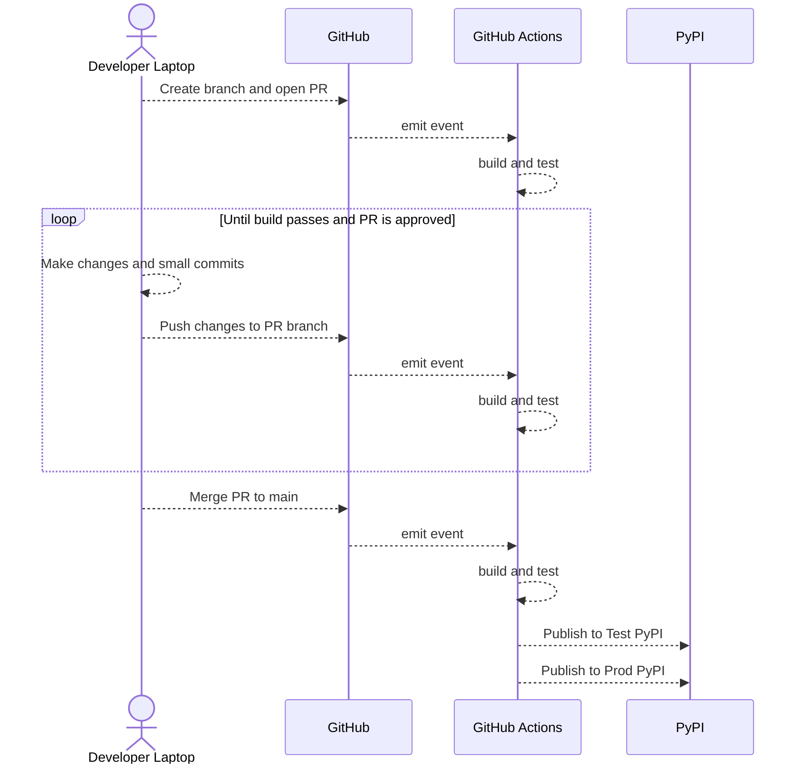

## High-level CI/CD Workflow for Python packages

```mermaid
sequenceDiagram
    actor Developer Laptop
    participant GitHub
    participant GitHub Actions
    participant PyPI

    Developer Laptop-->>GitHub: Create branch and open PR
    GitHub-->>GitHub Actions: emit event
    GitHub Actions-->>GitHub Actions: build and test

    loop Until build passes and PR is approved
        Developer Laptop-->>Developer Laptop: Make changes and small commits
        Developer Laptop-->>GitHub: Push changes to PR branch
        GitHub-->>GitHub Actions: emit event
        GitHub Actions-->>GitHub Actions: build and test
    end
    Developer Laptop-->>GitHub: Merge PR to main
    GitHub-->>GitHub Actions: emit event
    GitHub Actions-->>GitHub Actions: build and test
    GitHub Actions-->>PyPI: Publish to Test PyPI
    GitHub Actions-->>PyPI: Publish to Prod PyPI
```
